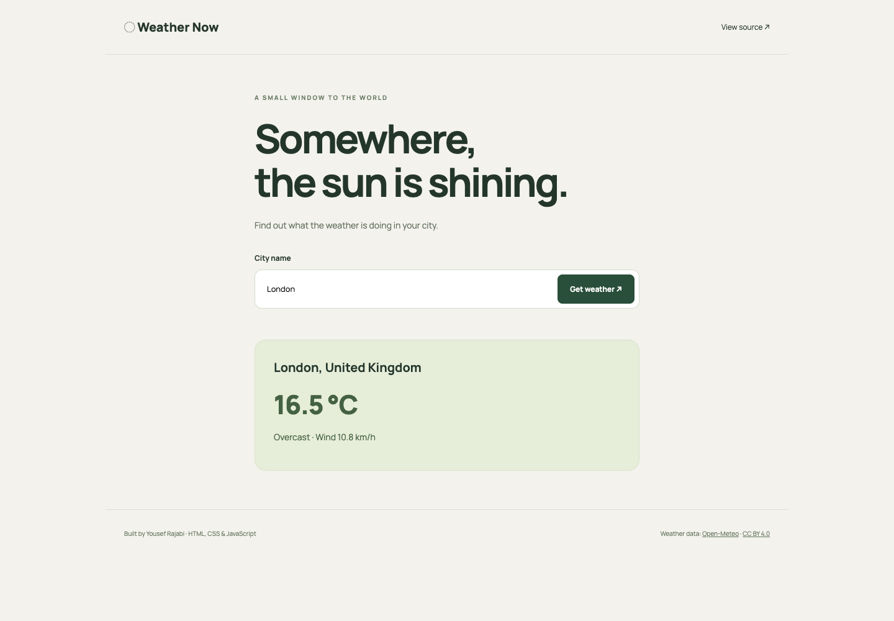

# Weather Now

A city weather lookup built with HTML, CSS, and JavaScript. The repository retains its original name, `amazon-clone`, to preserve existing links; the current application is a weather project, not an e-commerce clone.

## Screenshots



## Features

- Search a city through the Open-Meteo geocoding API.
- Show temperature, weather description, and wind speed.
- Submit with Enter or the search button.
- Clear loading, missing-city, and network-error feedback.
- Disable duplicate submissions while a request is in progress.
- Render external place names as text rather than injecting API data as HTML.
- Responsive layout with labeled form controls.

## Tech stack

HTML, CSS, JavaScript, Fetch API, async/await, Open-Meteo, Vite.

## Installation

Requires Node.js 22.12+ and npm.

```bash
git clone https://github.com/yousefrajabi06-debug/amazon-clone.git
cd amazon-clone
npm install
npm run dev
```

`npm run build` creates `dist/`; `npm run preview` serves the production build locally. No API key or environment file is required.

## What I learned

This project demonstrates DOM events, form handling, URL encoding, sequential asynchronous requests, HTTP error checks, and rendering data safely. The portfolio update preserves the original fetch functions while improving presentation and interaction.

## Future improvements

- Add a city selection step when multiple places share a name.
- Support unit switching and a multi-day forecast.
- Add a request timeout and retry control.

## Live demo

Not deployed in this update. Run locally using the commands above.

## Data attribution

Weather and geocoding data come from [Open-Meteo](https://open-meteo.com/) under [CC BY 4.0](https://creativecommons.org/licenses/by/4.0/). Internet access and service availability are required.

## Author

[Yousef Rajabi](https://github.com/yousefrajabi06-debug). Original learning project; presentation and small reliability improvements made with AI assistance.
